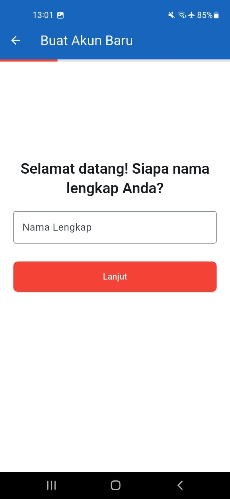
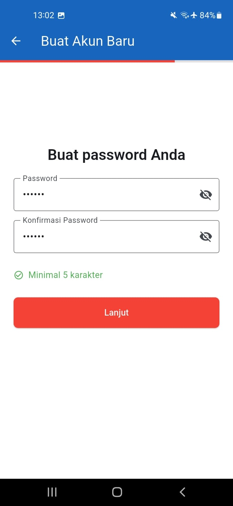
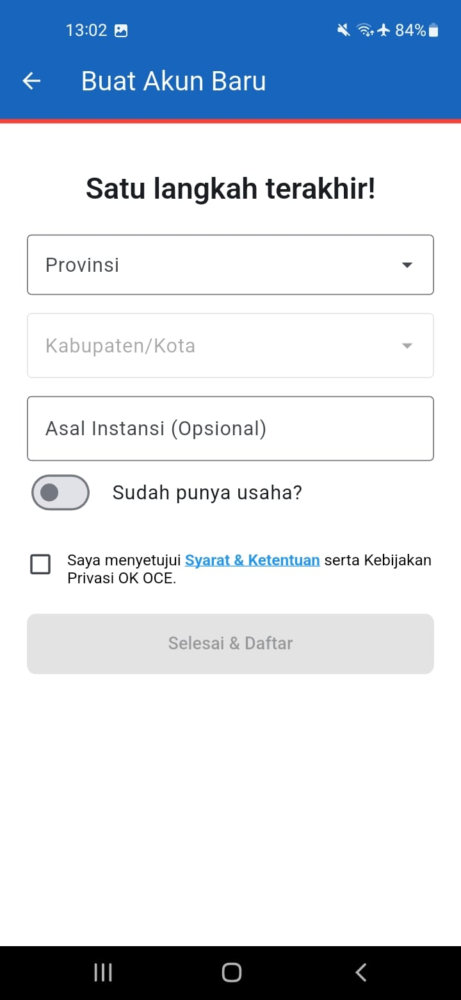
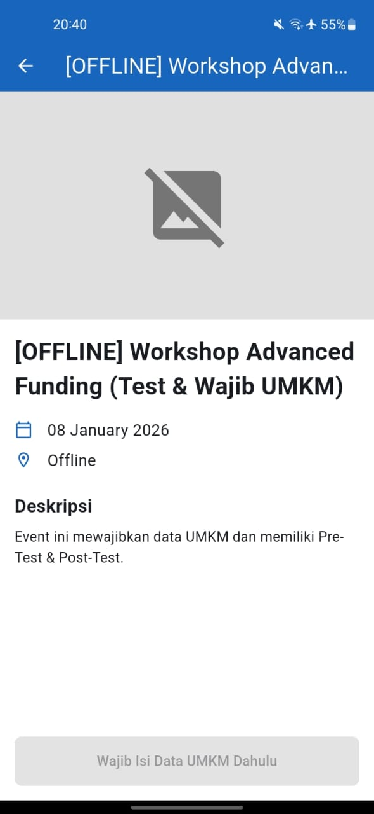
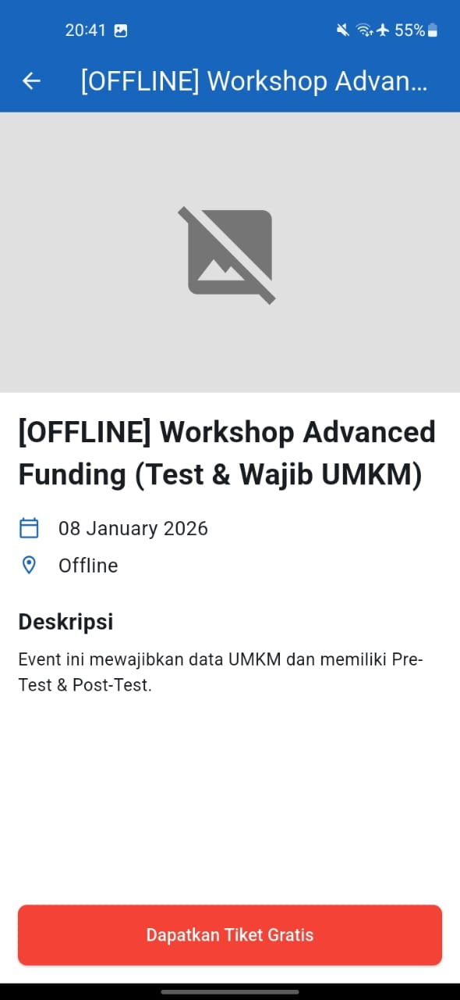
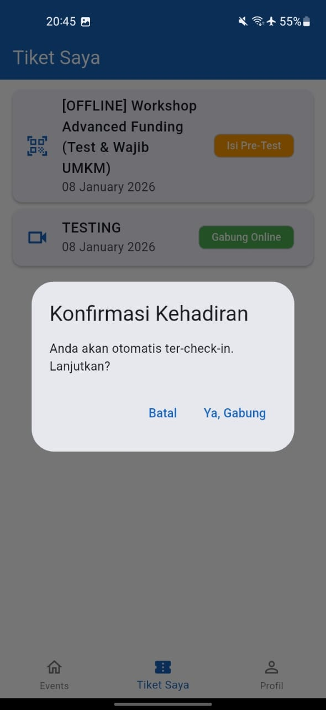
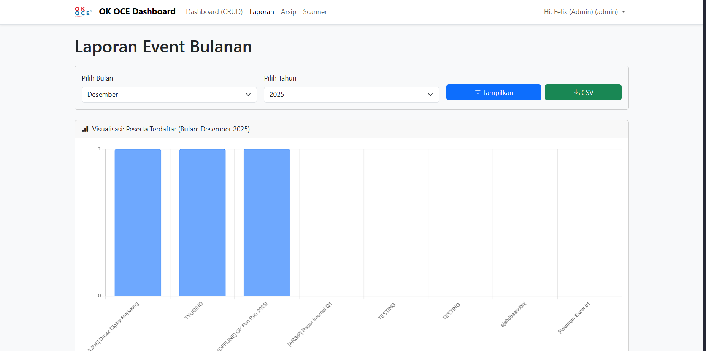
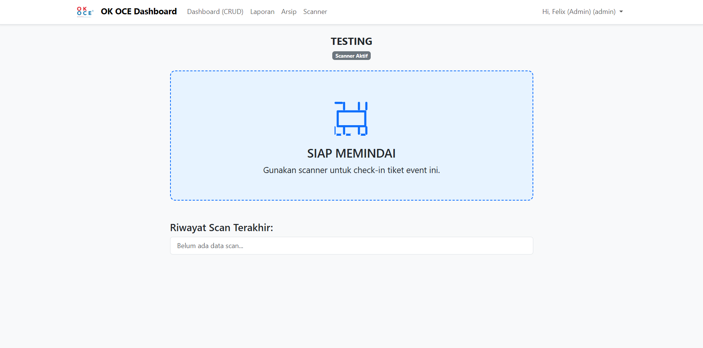

# OK OCE Integrated Event Management Ecosystem


An end-to-end digital ecosystem designed to digitize event management, ticketing, and educational impact measurement for **OK OCE Indonesia**, a national social movement for job creation.

This project replaces manual workflows with a unified platform consisting of a **Mobile App (Flutter)** for members and a **Web Dashboard (Flask)** for organizers, capable of handling hybrid events (Online/Offline) and complex business data validation.

---

## 📱 System Overview

### The Problem
Managing hundreds of events annually using manual tools (Google Forms & Spreadsheets) resulted in data redundancy, difficulty in validating member eligibility (UMKM status), and lack of quantitative data on training effectiveness.

### The Solution
A centralized system featuring:
* **Smart Registration Engine:** Real-time validation of quotas, time windows, and user profile completeness (UMKM Data).
* **Hybrid Ticketing:** Dynamic QR codes for offline check-in and direct Zoom integration for online events.
* **Integrated LMS:** Built-in Pre-Test & Post-Test modules linked to attendance status to measure impact.

---

## 🛠️ Tech Stack

### Mobile Application (User)
* **Framework:** Flutter (Dart)
* **Auth:** Custom Persistent Cookie Jar (replicating browser session behavior).
* **State Management:** `setState` & `AutomaticKeepAliveClientMixin` for multi-step form persistence.
* **Notifications:** Firebase Cloud Messaging (FCM) + Local Notifications.

### Backend API & Web Dashboard (Admin)
* **Core:** Python 3.11 with Flask.
* **Database:** PostgreSQL (Production) / SQLite (Development).
* **ORM:** SQLAlchemy.
* **Security:** Flask-Login (Session-based), Bcrypt Hashing, Role-Based Access Control (RBAC).
* **Infrastructure:** Docker & Docker Compose.

---

## 🚀 Key Technical Highlights

### 1. Smart Registration Button (Logic Gate)
I implemented a robust validation system on the mobile client. Instead of a simple "Register" button, the app checks 4 conditions in real-time before enabling the button.

```dart
// Core Logic: Validates if User meets specific criteria (e.g., Must own a Business)
Future<Map<String, dynamic>> _checkRegistrationStatus() async {
  // 1. Time Validation
  if (now.isBefore(openDate)) return {'isEnabled': false, 'text': 'Belum Dibuka'};
  
  // 2. Quota Validation
  if (registered >= quota) return {'isEnabled': false, 'text': 'Kuota Penuh'};
  
  // 3. Business Data Validation (Critical Logic)
  // Blocks registration if the event requires UMKM data but user profile is incomplete
  if (widget.event['is_umkm_data_required'] == true && !_hasBusiness) {
    return {'isEnabled': false, 'text': 'Wajib Lengkapi Data UMKM'};
  }
  
  return {'isEnabled': true, 'text': 'Daftar Sekarang'};
}

```

### 2. "Scan & Go" Polling System (Offline Event)

To ensure a smooth flow at the venue entrance, I built a polling mechanism. When the committee scans the user's QR code, the user's app updates automatically without manual refresh.

* **Mechanism:** `Timer` based short-polling to `/api/tickets/status`.
* **Optimization:** Timer is auto-cancelled on `dispose()` to prevent memory leaks.

### 3. Hardware-Ready Web Scanner

The Web Dashboard features a scanner interface optimized for physical **Handheld Barcode Scanners**. It uses an invisible, auto-focused input field to capture rapid scans without keyboard interaction.

---

## 📸 App Showcase

### 1. Multi-Step Registration Wizard (UX Focus)
Unlike standard forms, we implemented a **Sequential Wizard** with state persistence (`AutomaticKeepAliveClientMixin`). Users can navigate back and forth without losing their input data.

| Step 1: Identity | Step 3: Security | Step 4: Profile & Compliance |
|:---:|:---:|:---:|
|  |  |  |

---

### 2. "Smart Button" Logic Gate
The app proactively validates user eligibility. The registration button dynamically changes state based on **Quota**, **Time**, and **Business Profile (UMKM)** requirements.

| 🔒 Locked (Validation Failed) | ✅ Unlocked (Eligible) |
|:---:|:---:|
| <br><sub>User hasn't filled UMKM data yet</sub> | <br><sub>All requirements met</sub> |

---

### 3. Hybrid Ticketing System
The system handles two distinct event types seamlessly:
* **Offline Events:** Generates a dynamic QR Code for on-site scanning.
* **Online Events:** Provides a direct "Join Zoom" link that auto-records attendance upon clicking.

| 🎟️ Offline Ticket (QR) | 💻 Online Ticket (Zoom) |
|:---:|:---:|
|  |  |

---

### 4. Admin Dashboard & Hardware Scanner
Optimized for organizers, the web dashboard features real-time analytics and a **"Headless" Scanner Mode** designed for rapid hardware barcode scanners (no mouse clicks needed).

| 📊 Analytics Dashboard | 🔫 Rapid Scanner Interface |
|:---:|:---:|
|  |  |

---

## 🔧 Installation & Setup

This project is fully containerized using **Docker**.

### 1. Clone the repository

```bash
git clone [https://github.com/yourusername/okoce-event-system.git](https://github.com/yourusername/okoce-event-system.git)
cd okoce-event-system

```

### 2. Environment Configuration

Create a `.env` file in the root directory:

```env
SECRET_KEY="your_secret_key"
DATABASE_URL=postgresql://user:pass@db:5432/okoce_db
MAIL_USERNAME="your_email@gmail.com"
MAIL_PASSWORD="your_app_password"

```

### 3. Run with Docker Compose

```bash
docker-compose up --build

```

The Backend will be available at `http://localhost:8002`.

### 4. Database Seeding (Optional)

Populate the database with dummy data (Users, Events, Questions).

```bash
docker-compose exec web flask seed-db

```

---

## 📂 Project Structure

```
├── mobile_app/                 # Flutter Project
│   ├── lib/
│   │   ├── screens/           # UI Screens (Login, Event, Ticket, UMKM Form)
│   │   ├── utils/             # HTTP Client (CookieJar), Formatters
│   │   └── main.dart          # Entry point & FCM Config
│
├── backend/                    # Flask Project
│   ├── templates/             # HTML Templates (Jinja2 for Dashboard)
│   ├── app.py                 # Main Application Logic & Routes
│   ├── seed.py                # Database Seeder
│   └── Dockerfile             # Container Config
│
└── docker-compose.yml          # Service Orchestration

```

---

## 👨‍💻 Author

Developed as a Final Capstone Project for **Universitas Trisakti** (2025).

* **Role:** Full Stack Developer
* **Focus:** Mobile Development, Backend Architecture, & System Integration.
